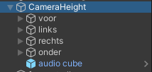
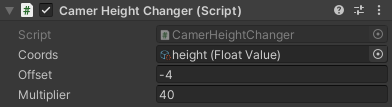
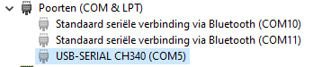

# Motion Trampoline

Unity workfile connecting with Kinect and Arduino to create a trampoline jumping experience for Motion.

## Installation

Download ```MotionTrampoline``` folder and open with Unity version 2020.1.3f1.

## Usage

Put any joint name in the List in ```BodySourceView.cs``` script for the Kinect to track:

```C#
    private List<Kinect.JointType> _joints = new List<Kinect.JointType>
    {
        Kinect.JointType.HandLeft,
        Kinect.JointType.HandRight,
        Kinect.JointType.Head,
    };
```

This scripts finds the coordinates the ```BodySourceView``` script generates. In this case the head's coordinates are used for the height of the camera.
```C#
    public float coordinate;

    private GameObject head;

    // Update is called once per frame
    void Update()
    {
        if (head == null)
        {
            head = GameObject.Find("Head");
        }
        if(head != null)
        {
            coordinate = head.transform.position.y;
        }
    }
```


When moving the cameras, move ```CameraHeight``` parent so the cameras stay together with eachother and the audioSource.



You can change the jumping factor from real life to in game by changing the multiplier on ```CameraHeight```. You can also change the offset on the y axis, which can be useful when the kinect is in a fixed position.




For the Arduino connection you will need to locate the right USB port you are using. This can be done in the device manager:



COM5 in ```fanscontroller.cs``` needs to be replaced by the port you are using.
```C#
public SerialPort serial = new SerialPort("COM5", 9600);
```

## Contributing
Thomas Dwarshuis (Kinect connection and code)

Dimitri van Iersel (Arduino connection and audio)
